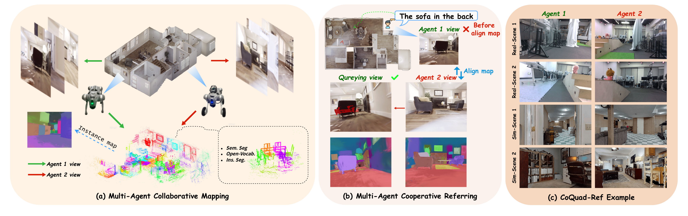
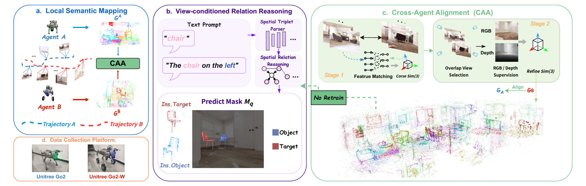

# 🤖✨ 𝘾𝙤𝙍𝙚𝙛-𝙂𝙎 ✨🤖

### Cooperative Referring Gaussian Splatting for Multi-Agent Scene Understanding

 

 

**Cooperative language-grounded scene understanding over independently reconstructed Gaussian maps.**

 

🚧 **Code · Dataset · Pretrained Models — Coming Soon**

 

---

## 🌟 Overview

**CoRef-GS** enables multiple robots to independently construct local semantic
Gaussian maps and integrate them into a shared representation for
**cooperative referring scene understanding**.

It preserves language-grounded referring ability across independently
reconstructed and aligned maps, while interpreting spatial relations from the
**querying robot's viewpoint**.

 

  

  
    <b>Figure 1.</b> Overview of CoRef-GS for cooperative multi-agent referring scene understanding.
  

 

### 🛰️ Perceive &nbsp; → &nbsp; 🗺️ Align &nbsp; → &nbsp; 🔗 Fuse &nbsp; → &nbsp; 🎯 Refer

 

---

## 🧩 Framework

  

  
    <b>Figure 2.</b> Overall framework of CoRef-GS.
  

 

---

### 📦 Release Status

`💻 Code — Coming Soon` &nbsp;&nbsp; · &nbsp;&nbsp;
`📚 CoQuad-Ref — Coming Soon` &nbsp;&nbsp; · &nbsp;&nbsp;
`🧠 Models — Coming Soon`

 

---
## 📦 Release Status

- [ ] 💻 Source Code
- [ ] 📚 CoQuad-Ref Dataset
- [ ] 🧠 Pretrained Models

